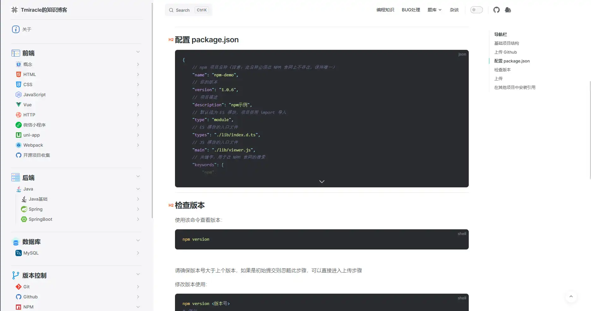

# vitepress-plugin-codeblocks-fold

[](https://www.npmjs.com/package/vitepress-plugin-codeblocks-fold)



> 给 vitepress 代码块添加折叠功能

<details open>
  <summary>更新日志</summary>
  <ul>
    <li>
      <p>v1.2.29</p>
      <p>修复锚点定位问题</p>
    </li>
    <li>
      <p>v1.2.28</p>
      <p>修复行号显示越界的问题</p>
    </li>
    <li>
      <p>v1.2.27</p>
      <p>去除滚动条样式</p>
    </li>
    <li>
      <p>v1.2.25</p>
      <p>修复横向滚动条不显示</p>
    </li>
  </ul>
</details>

## 安装

```shell
// npm 
npm i vitepress-plugin-codeblocks-fold
// yarn
yarn add vitepress-plugin-codeblocks-fold
```

## 使用

```js
// .vitepress/theme/index.js
import DefaultTheme from 'vitepress/theme';
import { useData, useRoute } from 'vitepress';
import codeblocksFold from 'vitepress-plugin-codeblocks-fold'; // 导入方法
import 'vitepress-plugin-codeblocks-fold/style/index.css'; // 导入样式

export default {
    ...DefaultTheme,
    enhanceApp(ctx) {
        DefaultTheme.enhanceApp(ctx);
        // ...
    },
    setup() {
        // 获取前言和路由
        const { frontmatter } = useData();
        const route = useRoute();
        // 基础使用
        codeblocksFold({ route, frontmatter }, true, 400);
    }
};
```

`codeblocksFold()` 接收三个参数：

- vitepressObj

  这是一个对象，对象里面必须有两个值：路由和前言。

- defaultAllFold

  是否默认所有页面的代码块都设置成折叠状态，默认为 `true`；设置成 `false` 则默认不折叠。可以忽略不填。

- height

  代码块被折叠后的高度，默认为 `400`（单位`px`）。可以忽略不填。

## 扩展使用

单个.md文件可以设置前言

```md
---
cbf: [1,2,3]
---
```

该数组含义为：

- 当 `defaultAllFold` 设置为 `true` （即默认全部页面开启折叠）时，当前页面第 1、2、3 个代码块强制不开启折叠
- 当 `defaultAllFold` 设置为 `false` （即默认全部页面不开启折叠）时，当前页面第 1、2、3 个代码块强制开启折叠

`cbf` 还有两个参数：`true` 和 `false`

- `true` 表示当前页面所有代码块开启折叠
- `false` 表示当前页面所有代码块不开启折叠

## 更多vitepress插件

这些插件你可能会感兴趣：[点我查看更多vitepress插件](https://github.com/T-miracle/vitepress-plugins)

